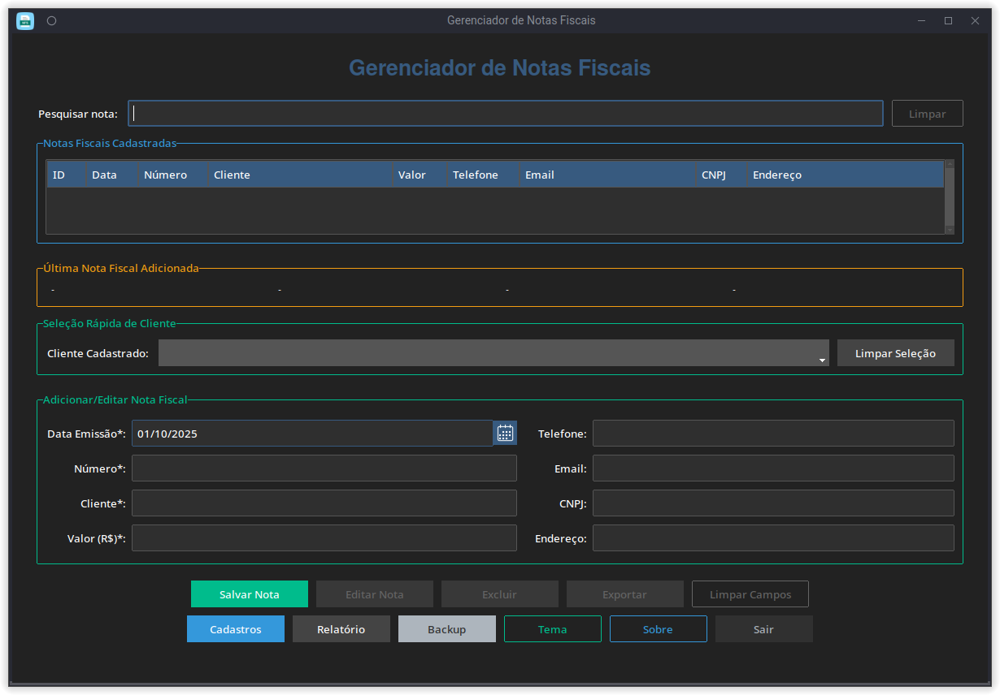

# Gerenciador de Notas Fiscais

 <!-- Substitua 'preview.png' pela imagem de demonstração -->

## Descrição

O **Gerenciador de Notas Fiscais** é um sistema simples para gerenciamento de notas fiscais, permitindo:

* Adicionar, visualizar e editar informações de suas notas.
* Excluir notas individuais ou todas as notas do banco.
* Exportar notas para CSV.
* Fazer backups das notas.
* Aplicar temas visuais ao sistema.
* Gerar relatórios básicos.

> **Importante:** O programa **não é um emissor de notas fiscais**.
> Ele serve para armazenar e calcular os valores das notas lançadas, ideal para MEIs ou pequenas empresas.

O aplicativo utiliza uma interface gráfica baseada em **ttkbootstrap**, garantindo temas modernos e responsivos.

---

## Pré-requisitos

* **Python 3.11** ou superior
* Dependências Python:

```bash
pip install -r requirements.txt
```

> Certifique-se de que `ttkbootstrap` está instalado, pois é a base da interface gráfica.

---

## Instalação

### Linux (usuário local)

Execute o instalador:

```bash
bash install.sh
```

O instalador fará:

1. Criar pastas no diretório do usuário:

   * `~/.local/share/gerenciador_de_notas_fiscais/`
   * `~/.local/bin/`
   * `~/.local/share/icons/`
   * `~/.local/share/applications/`
2. Copiar arquivos do projeto e criar a pasta `data` com arquivos padrão.
3. Criar script lançador: `gerenciador_de_notas_fiscais`
4. Criar atalho `.desktop` no menu de aplicativos.

> Para desinstalar, use:

```bash
bash uninstall.sh
```

Após a instalação, inicie o aplicativo pelo terminal:

```bash
gerenciador_de_notas_fiscais
```

Ou pelo menu de aplicativos.

---

### Windows (usuário local)

Você pode instalar de duas maneiras:

#### 1. Usando o **install.bat**

Clique duas vezes ou execute pelo Prompt de Comando:

```bat
install.bat
```

O instalador fará:

* Criar pasta de instalação em `%LOCALAPPDATA%\gerenciador_de_notas_fiscais`
* Criar atalho no Menu Iniciar (`Gerenciador de Notas Fiscais.lnk`)
* Copiar arquivos do projeto e criar `data` com arquivos padrão

> Para desinstalar, execute **uninstall.bat**:

```bat
uninstall.bat
```

#### 2. Usando o **arquivo .exe**

Basta executar o arquivo `Gerenciador De Notas Fiscais.exe`:

* O instalador criará a pasta de instalação conforme for definido
* Criará automaticamente o atalho no Menu Iniciar
* Copiará os arquivos necessários e estará pronto para execução, sem precisar instalar dependências antes.

> Para desinstalar, vá em **Adicionar ou Remover Programas** no Windows.

---

## Verificação de Dependências (Linux / Windows)

Antes da instalação, o instalador verifica automaticamente:

* Se o Python está instalado
* Se o `pip` está disponível
* Se o `ttkbootstrap` e outras dependências do `requirements.txt` estão instaladas

Caso alguma dependência esteja faltando, o instalador exibirá instruções para instalar.

Exemplo de checagem manual:

```bash
# Linux / macOS
python3 --version
pip install -r requirements.txt

# Windows (Prompt de Comando)
python --version
pip install -r requirements.txt
```

---

## Funcionalidades

* **Adicionar nota:** Insira uma nova nota fiscal com todos os dados necessários.
* **Visualizar nota:** Consulte detalhes de uma nota específica.
* **Editar nota:** Altere informações de notas existentes.
* **Excluir nota(s):** Remova notas individuais ou todas de uma vez.
* **Exportar notas:** Salve as notas selecionadas ou todas em CSV.
* **Backup:** Faça backup das notas, mesmo com o banco vazio.
* **Tema:** Alteração de aparência da interface usando ttkbootstrap.
* **Relatório:** Gere relatórios básicos das notas armazenadas.

---

## Contribuição

Contribuições são bem-vindas! Você pode:

* Abrir issues para reportar bugs.
* Enviar pull requests para melhorias ou novas funcionalidades.

---

## Doações

Se você gosta do projeto e deseja contribuir, pode fazer uma doação via Pix utilizando a chave abaixo ou escaneando o QR Code:

**Chave Pix:** `8904ad59-b488-42d8-8ea3-bb008b8dfd95`

<p align="center">
  
</p>


---

## Licença

Este projeto é licenciado sob a [MIT License](LICENSE).
